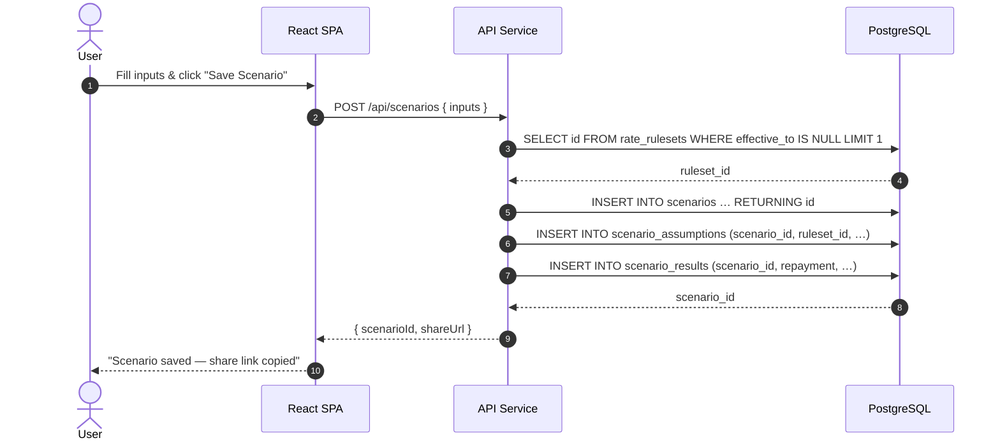
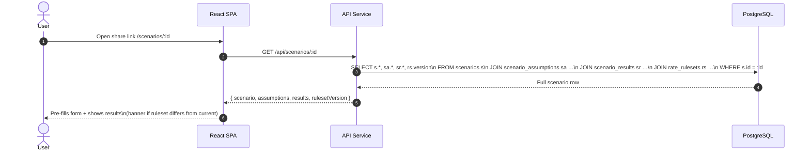

# Database Schema

_Last updated: 2026-04-13_

> **Status:** No database is implemented in the current release. All calculations are performed client-side. This document defines the proposed schema for the backend persistence phase.

---

## 1. Entity Relationship Diagram

```mermaid
erDiagram
    USERS ||--o{ SCENARIOS : "owns"
    SCENARIOS ||--o{ SCENARIO_ASSUMPTIONS : "has one"
    SCENARIOS ||--o{ SCENARIO_RESULTS : "produces one"
    RATE_RULESETS ||--o{ STAMP_DUTY_BRACKETS : "contains"
    RATE_RULESETS ||--o{ LMI_TIERS : "contains"
    SCENARIO_ASSUMPTIONS }o--|| RATE_RULESETS : "references"

    USERS {
      uuid      id           PK
      text      email        UK
      text      display_name
      timestamptz created_at
      timestamptz updated_at
    }

    SCENARIOS {
      uuid        id                PK
      uuid        user_id           FK
      text        name
      text        state_code
      numeric     property_value
      numeric     loan_amount
      numeric     annual_rate_pct
      int         term_years
      text        repayment_frequency
      boolean     include_lmi
      timestamptz created_at
      timestamptz updated_at
    }

    SCENARIO_ASSUMPTIONS {
      uuid        id                PK
      uuid        scenario_id       FK  UK
      numeric     offset_balance
      numeric     extra_repayment
      numeric     lmi_estimate
      numeric     stamp_duty_estimate
      uuid        ruleset_id        FK
      timestamptz created_at
    }

    SCENARIO_RESULTS {
      uuid        id                PK
      uuid        scenario_id       FK  UK
      numeric     repayment_amount
      numeric     total_interest
      numeric     total_paid
      int         periods
      jsonb       amortization_preview
      timestamptz created_at
    }

    RATE_RULESETS {
      uuid        id                PK
      text        version           UK
      text        description
      date        effective_from
      date        effective_to
      timestamptz created_at
    }

    STAMP_DUTY_BRACKETS {
      uuid        id                PK
      uuid        ruleset_id        FK
      text        state_code
      numeric     threshold_from
      numeric     threshold_to
      numeric     base_amount
      numeric     marginal_rate
      int         sort_order
    }

    LMI_TIERS {
      uuid        id                PK
      uuid        ruleset_id        FK
      numeric     lvr_from_pct
      numeric     lvr_to_pct
      numeric     rate_pct
    }
```

---

## 2. Table Definitions

### `users`

```sql
CREATE TABLE users (
    id           UUID PRIMARY KEY DEFAULT gen_random_uuid(),
    email        TEXT NOT NULL UNIQUE,
    display_name TEXT,
    created_at   TIMESTAMPTZ NOT NULL DEFAULT NOW(),
    updated_at   TIMESTAMPTZ NOT NULL DEFAULT NOW()
);
```

### `scenarios`

```sql
CREATE TABLE scenarios (
    id                   UUID PRIMARY KEY DEFAULT gen_random_uuid(),
    user_id              UUID NOT NULL REFERENCES users(id) ON DELETE CASCADE,
    name                 TEXT NOT NULL,
    state_code           TEXT NOT NULL CHECK (state_code IN ('NSW','VIC','QLD','SA','WA','TAS','ACT','NT')),
    property_value       NUMERIC(14,2) NOT NULL CHECK (property_value > 0),
    loan_amount          NUMERIC(14,2) NOT NULL CHECK (loan_amount > 0),
    annual_rate_pct      NUMERIC(6,4)  NOT NULL CHECK (annual_rate_pct >= 0),
    term_years           INT           NOT NULL CHECK (term_years BETWEEN 1 AND 40),
    repayment_frequency  TEXT          NOT NULL CHECK (repayment_frequency IN ('monthly','fortnightly','weekly')),
    include_lmi          BOOLEAN       NOT NULL DEFAULT TRUE,
    created_at           TIMESTAMPTZ   NOT NULL DEFAULT NOW(),
    updated_at           TIMESTAMPTZ   NOT NULL DEFAULT NOW()
);

CREATE INDEX scenarios_user_id_idx ON scenarios (user_id);
CREATE INDEX scenarios_created_at_idx ON scenarios (created_at DESC);
```

### `scenario_assumptions`

```sql
CREATE TABLE scenario_assumptions (
    id                    UUID PRIMARY KEY DEFAULT gen_random_uuid(),
    scenario_id           UUID NOT NULL UNIQUE REFERENCES scenarios(id) ON DELETE CASCADE,
    offset_balance        NUMERIC(14,2) NOT NULL DEFAULT 0 CHECK (offset_balance >= 0),
    extra_repayment       NUMERIC(10,2) NOT NULL DEFAULT 0 CHECK (extra_repayment >= 0),
    lmi_estimate          NUMERIC(12,2) NOT NULL DEFAULT 0,
    stamp_duty_estimate   NUMERIC(12,2) NOT NULL DEFAULT 0,
    ruleset_id            UUID NOT NULL REFERENCES rate_rulesets(id),
    created_at            TIMESTAMPTZ NOT NULL DEFAULT NOW()
);
```

### `scenario_results`

```sql
CREATE TABLE scenario_results (
    id                    UUID PRIMARY KEY DEFAULT gen_random_uuid(),
    scenario_id           UUID NOT NULL UNIQUE REFERENCES scenarios(id) ON DELETE CASCADE,
    repayment_amount      NUMERIC(12,2) NOT NULL,
    total_interest        NUMERIC(16,2) NOT NULL,
    total_paid            NUMERIC(16,2) NOT NULL,
    periods               INT NOT NULL,
    -- Trimmed schedule: first 12 and last 12 entries for quick chart rendering.
    -- Full schedule is recomputed client-side when needed.
    amortization_preview  JSONB,
    created_at            TIMESTAMPTZ NOT NULL DEFAULT NOW()
);
```

### `rate_rulesets`

Versioned container for stamp duty brackets and LMI tiers, enabling auditability when rules change.

```sql
CREATE TABLE rate_rulesets (
    id             UUID PRIMARY KEY DEFAULT gen_random_uuid(),
    version        TEXT NOT NULL UNIQUE,  -- e.g. "2024-07"
    description    TEXT,
    effective_from DATE NOT NULL,
    effective_to   DATE,                  -- NULL = currently active
    created_at     TIMESTAMPTZ NOT NULL DEFAULT NOW()
);
```

### `stamp_duty_brackets`

```sql
CREATE TABLE stamp_duty_brackets (
    id             UUID PRIMARY KEY DEFAULT gen_random_uuid(),
    ruleset_id     UUID NOT NULL REFERENCES rate_rulesets(id),
    state_code     TEXT NOT NULL CHECK (state_code IN ('NSW','VIC','QLD','SA','WA','TAS','ACT','NT')),
    threshold_from NUMERIC(14,2) NOT NULL DEFAULT 0,
    threshold_to   NUMERIC(14,2),               -- NULL = unbounded
    base_amount    NUMERIC(12,2) NOT NULL DEFAULT 0,
    marginal_rate  NUMERIC(8,6)  NOT NULL,       -- e.g. 0.035 = 3.5 %
    sort_order     INT           NOT NULL DEFAULT 0
);

CREATE INDEX stamp_duty_brackets_ruleset_state_idx
    ON stamp_duty_brackets (ruleset_id, state_code, sort_order);
```

### `lmi_tiers`

```sql
CREATE TABLE lmi_tiers (
    id           UUID PRIMARY KEY DEFAULT gen_random_uuid(),
    ruleset_id   UUID    NOT NULL REFERENCES rate_rulesets(id),
    lvr_from_pct NUMERIC(5,2) NOT NULL,   -- e.g. 80.00
    lvr_to_pct   NUMERIC(5,2),            -- NULL = unbounded
    rate_pct     NUMERIC(6,4) NOT NULL    -- e.g. 0.016 = 1.6 %
);

CREATE INDEX lmi_tiers_ruleset_idx ON lmi_tiers (ruleset_id, lvr_from_pct);
```

---

## 3. Data Flow (Save Scenario)



---

## 4. Data Flow (Load Scenario)



---

## 5. Indexing Strategy

| Table | Index | Reason |
|-------|-------|--------|
| `scenarios` | `(user_id)` | List all scenarios for a user |
| `scenarios` | `(created_at DESC)` | Recent-first sorting on dashboard |
| `stamp_duty_brackets` | `(ruleset_id, state_code, sort_order)` | Fast bracket lookup at calculation time |
| `lmi_tiers` | `(ruleset_id, lvr_from_pct)` | Tier lookup by LVR value |

---

## 6. Seed Data — Initial Ruleset

```sql
-- Insert the initial rate ruleset
INSERT INTO rate_rulesets (id, version, description, effective_from)
VALUES (
    '00000000-0000-0000-0000-000000000001',
    '2024-07',
    'Stamp duty and LMI rates as at July 2024',
    '2024-07-01'
);

-- NSW stamp duty brackets
INSERT INTO stamp_duty_brackets
    (ruleset_id, state_code, threshold_from, threshold_to, base_amount, marginal_rate, sort_order)
VALUES
    ('00000000-0000-0000-0000-000000000001', 'NSW',       0,   17000,     0,      0.0125, 1),
    ('00000000-0000-0000-0000-000000000001', 'NSW',   17000,   36000,   212,      0.015,  2),
    ('00000000-0000-0000-0000-000000000001', 'NSW',   36000,   97000,   497,      0.0175, 3),
    ('00000000-0000-0000-0000-000000000001', 'NSW',   97000,  364000,  1564,      0.035,  4),
    ('00000000-0000-0000-0000-000000000001', 'NSW',  364000, 1212000, 10909,      0.045,  5),
    ('00000000-0000-0000-0000-000000000001', 'NSW', 1212000,    NULL, 48909,      0.055,  6);

-- LMI tiers
INSERT INTO lmi_tiers (ruleset_id, lvr_from_pct, lvr_to_pct, rate_pct)
VALUES
    ('00000000-0000-0000-0000-000000000001',  0.00, 80.00, 0.0000),
    ('00000000-0000-0000-0000-000000000001', 80.01, 85.00, 0.0080),
    ('00000000-0000-0000-0000-000000000001', 85.01, 90.00, 0.0160),
    ('00000000-0000-0000-0000-000000000001', 90.01, 95.00, 0.0280),
    ('00000000-0000-0000-0000-000000000001', 95.01,  NULL, 0.0400);
```

---

## 7. Migration Notes

- All migrations should be applied with a tool such as **Flyway** or **golang-migrate** and stored in `db/migrations/`.
- Naming convention: `V{YYYY}{MM}{DD}{HH}{MM}__description.sql`.
- The `rate_rulesets` table is **append-only**; never delete or update existing rows. Close a ruleset by setting `effective_to`.
- The `amortization_preview` JSONB column stores a trimmed schedule (first 12 + last 12 entries). The full schedule is recomputed client-side from the saved inputs when the user loads a scenario.
