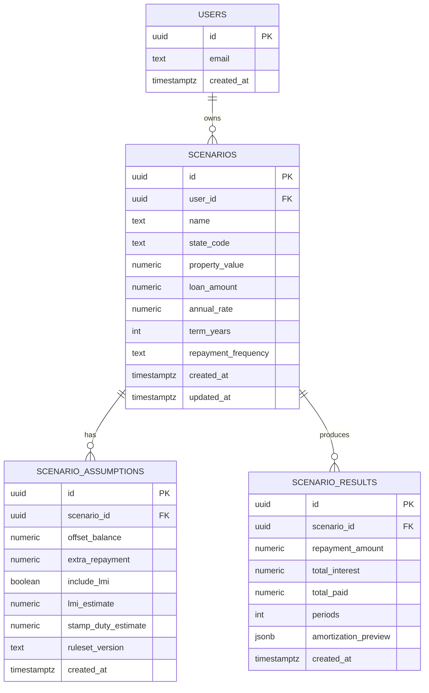

# Database Schema

## Current State

There is **no database schema implemented** in the current repository. The app computes results in-browser only.

## Proposed Schema (for next phase)

## Notes

- `ruleset_version` allows traceability when stamp duty or LMI estimate rules change.
- `amortization_preview` can store a trimmed schedule for quick rendering; full rows could live in a dedicated table if needed.
