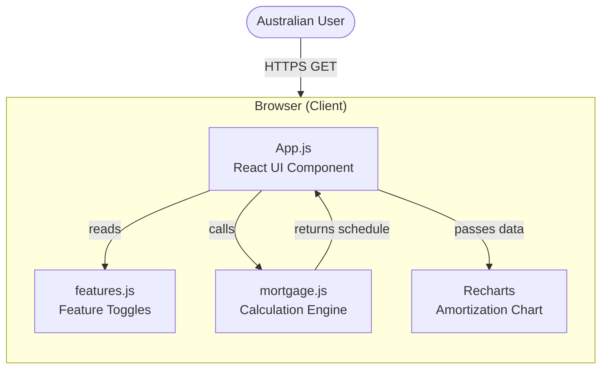
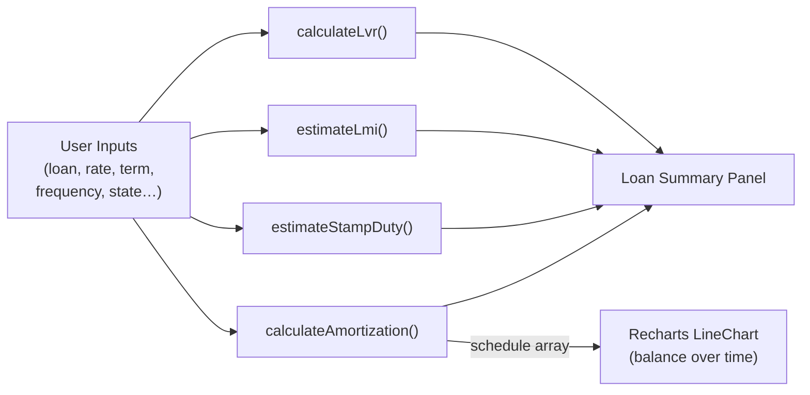
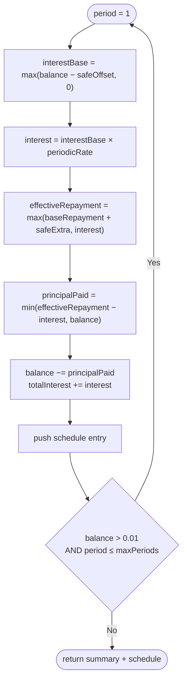
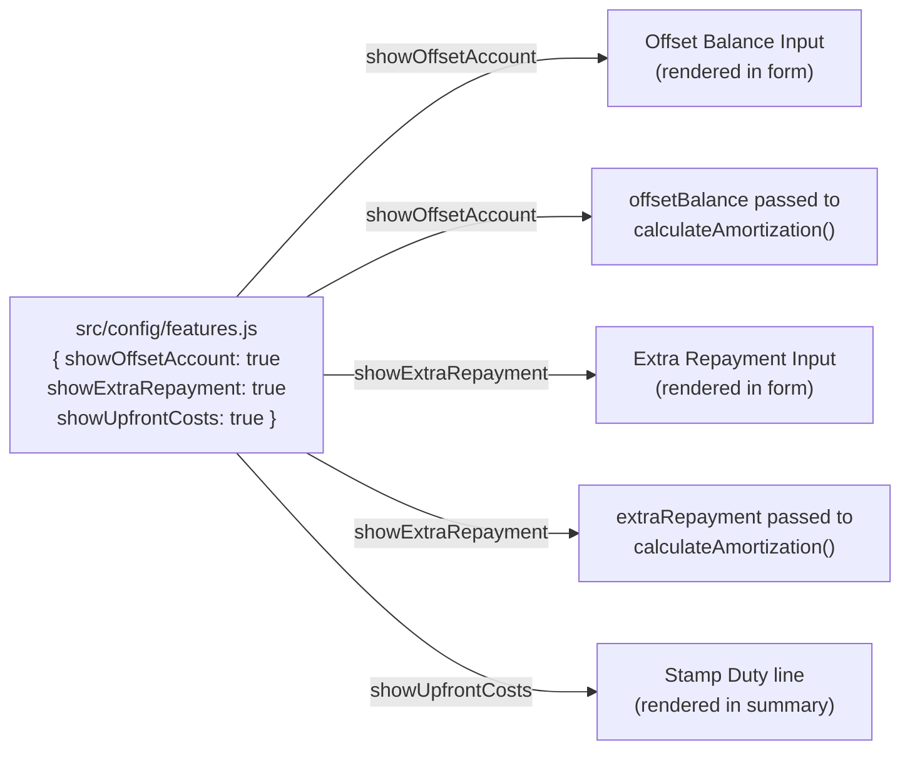
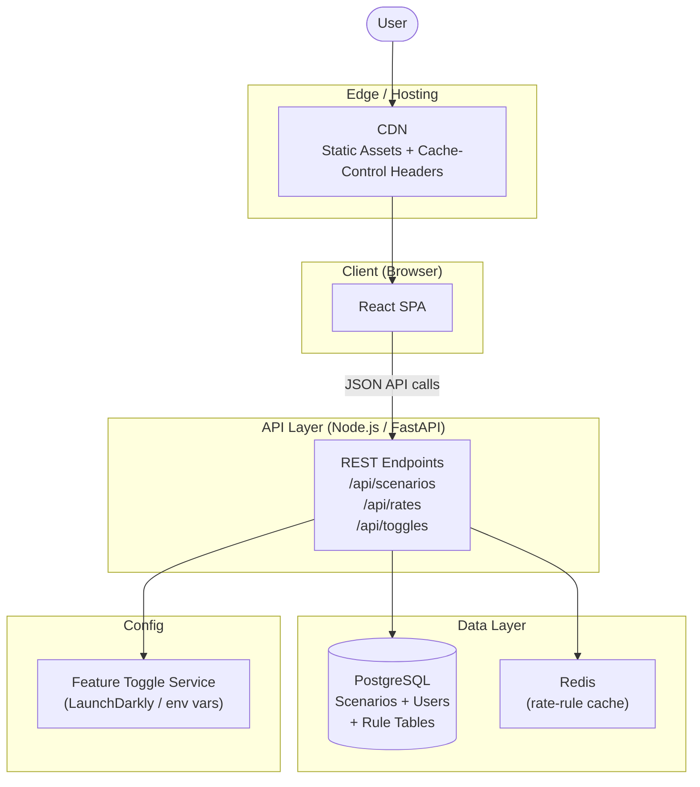
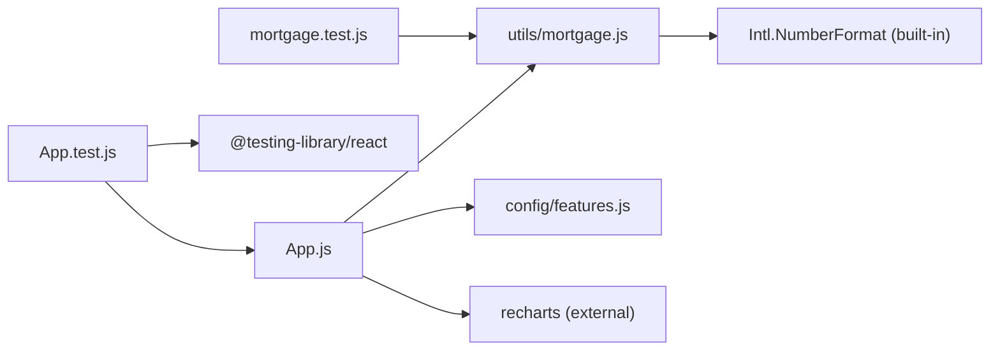

# System Architecture

_Last updated: 2026-04-13_

---

## 1. Current Architecture — Frontend-Only SPA

The current release is a **client-side-only React single-page application**. All financial calculations execute in the user's browser; there is no API server and no database.



### Component Responsibilities

| File | Role |
|------|------|
| `src/App.js` | Stateful React component. Owns all form inputs, calls calculation functions via `useMemo`, renders summary panel and chart |
| `src/utils/mortgage.js` | Pure calculation functions: LVR, LMI, stamp duty, repayment formula, amortization schedule |
| `src/config/features.js` | Build-time feature flags consumed by `App.js` to show/hide UI sections and conditionally apply offset/extra repayment in calculations |
| `scripts/deploy.sh` | CI-compatible build-test-copy script for Ubuntu servers |

---

## 2. Calculation Data Flow



### Amortization Loop (per period)



---

## 3. Feature Toggle Flow



> **Current limitation:** toggles are hard-coded at build time. Changing a toggle requires a code commit and full redeploy. Phase 3 of the roadmap migrates this to `REACT_APP_*` environment variables or a remote config service.

---

## 4. Deployment Workflow

```mermaid
sequenceDiagram
    autonumber
    actor Dev as Developer / CI
    participant Script as scripts/deploy.sh
    participant Host as Ubuntu Server

    Dev->>Script: ./scripts/deploy.sh /var/www/mortgage-calculator
    Script->>Host: npm ci
    Note over Host: Clean install from package-lock.json
    Script->>Host: CI=true npm test -- --watchAll=false
    Note over Host: Aborts on any test failure
    Script->>Host: npm run build
    Note over Host: Creates /build directory
    Script->>Host: rm -rf /TARGET/* && cp -R build/* /TARGET
    Note over Host: Atomic replace; refuses to deploy to / or empty path
    Host-->>Dev: "Deployment complete: /TARGET"
```

---

## 5. Proposed Production Architecture (Next Phase)

When backend persistence is added, the target architecture is:



### API Surface (proposed)

| Method | Endpoint | Description |
|--------|----------|-------------|
| `POST` | `/api/scenarios` | Save a new mortgage scenario |
| `GET` | `/api/scenarios/:id` | Retrieve a saved scenario with results |
| `GET` | `/api/rates/stamp-duty` | Return versioned stamp duty brackets by state |
| `GET` | `/api/rates/lmi` | Return versioned LMI rate tiers |
| `GET` | `/api/toggles` | Return current feature toggle state |

---

## 6. Component Dependency Graph



---

## 7. Runtime Characteristics

| Property | Value |
|----------|-------|
| Bundle size (gzip) | 159 KB (measured: `npm run build`, React 19 + Recharts 2.x) |
| Calculation complexity | O(n) where n = years × periods/year (max 1 560 for 30-yr weekly) |
| Browser support | Modern evergreen browsers (no IE) |
| Network calls at runtime | None (current release) |
| Server requirement | Any static file host (nginx, Apache, Netlify, S3+CloudFront) |
