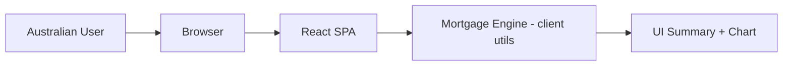
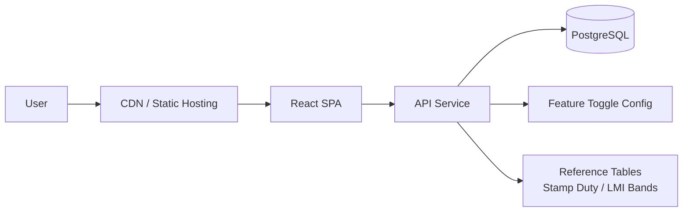
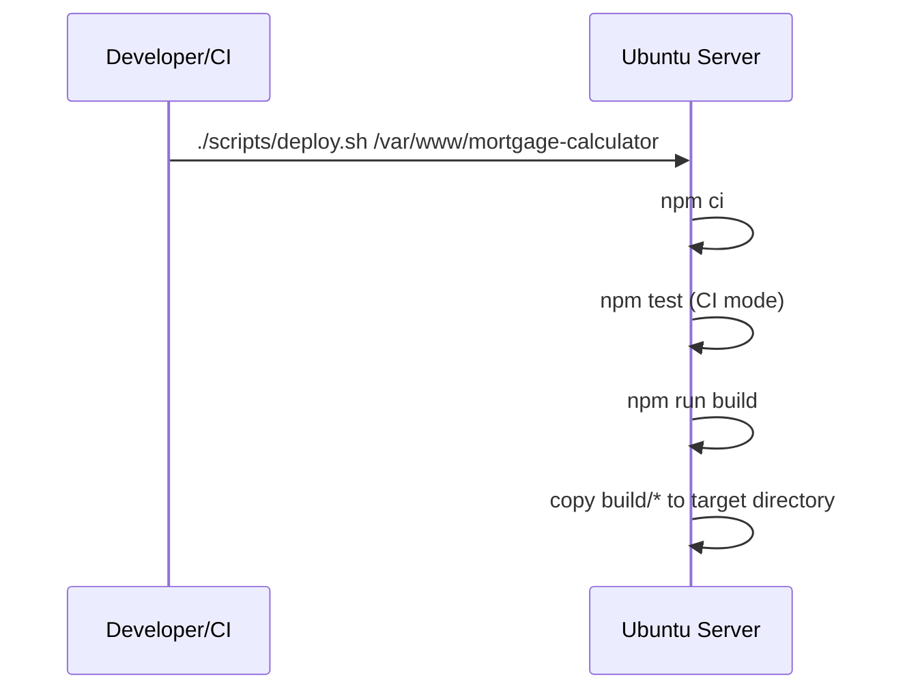

# System Architecture

## Current Application Shape

This repository currently ships a **frontend-only** React SPA. There is no backend API or database runtime dependency.

## Proposed Production Architecture

## Runtime Components

- `src/App.js` – Main Australian mortgage UI and result rendering.
- `src/utils/mortgage.js` – Core calculation engine for repayments, amortization, LVR/LMI, and stamp duty estimates.
- `src/config/features.js` – Feature toggles used by the UI.
- `scripts/deploy.sh` – Ubuntu-friendly build/test/deploy script for static output.

## Deployment Workflow

